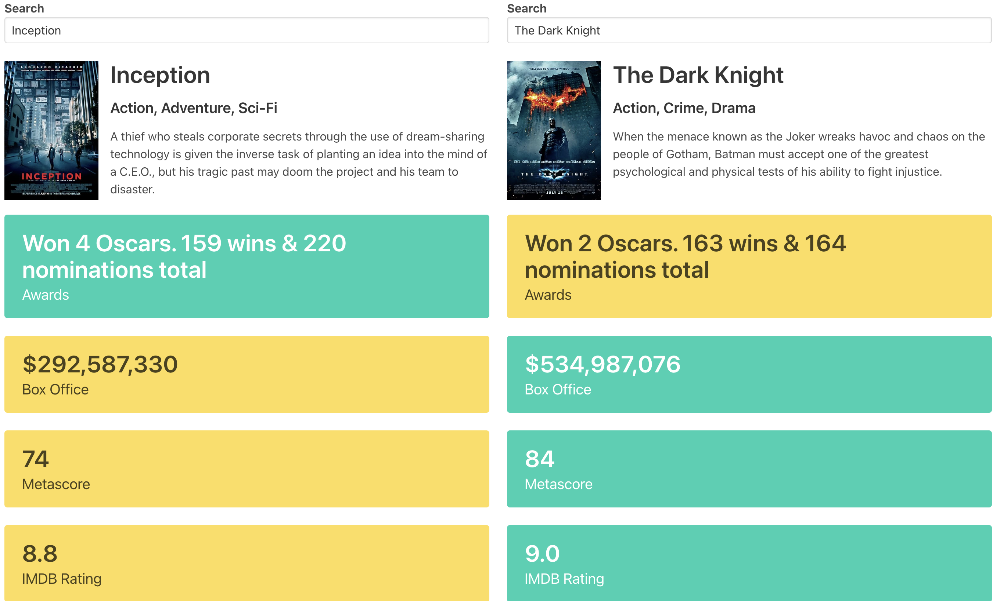

# Movie Fight

This web app lets you search two movies and highlights the winner by comparing their awards, box office, meta scores, IMDB ratings, and IMDB votes. The app implicitly makes api request to http://www.omdbapi.com/.

## Setup

1. create a config.js file and supply omdbapi API and set it to `OMDB_API`
2. open up index.html in a browser and you are good to go

## Usage

1. Search and select two movies from the input fields, then it will tell you the winner.
